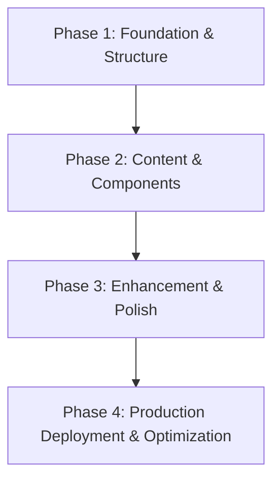

# Project Roadmap: Personal Portfolio Website

**Last Updated**: 2025-05-26

## 1. Overall Project Vision & Goals
*   Create a modern, responsive personal portfolio website that effectively showcases technical skills and projects
*   Implement clean, accessible design with smooth user experience across all devices
*   Build a maintainable codebase that can evolve with career growth and new projects

## 2. Major Project Phases / Epics

### Phase 1: Foundation & Structure
*   **Description**: Establish project foundation with HTML structure, basic styling, and responsive layout
*   **Status**: ✅ Completed (2025-05-26)
*   **Key Objectives**:
    *   Create semantic HTML5 document structure
    *   Implement responsive CSS grid/flexbox layout
    *   Establish design system and component architecture
*   **Primary HDTA Links**: 
    *   `memory-bank/frontend_module.md`
    *   `memory-bank/styling_module.md`
    *   `memory-bank/implementation_plan_html_structure.md`
*   **Notes/Key Deliverables for this Phase**:
    *   Fully responsive HTML/CSS foundation
    *   Mobile-first design system
    *   Accessible navigation and layout

### Phase 2: Content & Components
*   **Description**: Develop content management system and interactive components for portfolio showcase
*   **Status**: ✅ Completed (2025-05-26)
*   **Key Objectives**:
    *   Create project showcase components ✅
    *   Implement skills visualization ✅
    *   Build contact form and social integration ✅
*   **Primary HDTA Links**: 
    *   `memory-bank/components_module.md`
    *   `memory-bank/content_module.md`
*   **Notes/Key Deliverables for this Phase**:
    *   Interactive project gallery with GitHub API integration ✅
    *   Dynamic content loading with JSON system ✅
    *   Professional asset management system ✅

### Phase 3: Enhancement & Polish
*   **Description**: Add advanced features, animations, and performance optimizations
*   **Status**: ✅ Completed (2025-05-26)
*   **Key Objectives**:
    *   Implement smooth animations and transitions ✅
    *   Add GitHub API integration ✅
    *   Create professional asset management ✅
*   **Primary HDTA Links**: 
    *   `memory-bank/styling_module.md`
*   **Notes/Key Deliverables for this Phase**:
    *   Advanced scroll animations and micro-interactions ✅
    *   GitHub API integration with live data ✅
    *   Professional asset system with optimization ✅

### Phase 4: Production Deployment & Optimization
*   **Description**: Final production optimization, SEO, and deployment preparation
*   **Status**: 🔄 In Progress (Branch: feature/phase-4-production-deployment)
*   **Key Objectives**:
    *   Implement dark mode with system preference detection
    *   Complete SEO optimization and meta tags
    *   Integrate Netlify Forms and achieve Lighthouse 90+ scores
    *   Set up production deployment with custom domain
*   **Primary HDTA Links**: 
    *   `BRANCH-README.md`
*   **Notes/Key Deliverables for this Phase**:
    *   Dark mode toggle with persistence
    *   WebP image optimization and lazy loading
    *   Complete SEO framework with structured data
    *   Production-ready deployment with analytics

---

## 3. High-Level Inter-Phase Dependencies

## 4. Key Project-Wide Milestones
*   **HTML Structure Complete**: Semantic foundation with responsive layout - Status: Planned
*   **Component System Working**: All interactive elements functional - Status: Planned
*   **MVP Launch Ready**: Fully functional portfolio website - Status: Planned
*   **Performance Optimized**: Fast loading, SEO optimized - Status: Planned

## 5. Overall Project Notes / Strategic Considerations
*   Focus on mobile-first responsive design to ensure optimal experience across devices
*   Maintain accessibility standards (WCAG 2.1 AA) throughout development
*   Build with scalability in mind to easily add new projects and sections
*   Consider performance from the start - optimize images, minimize code, fast loading